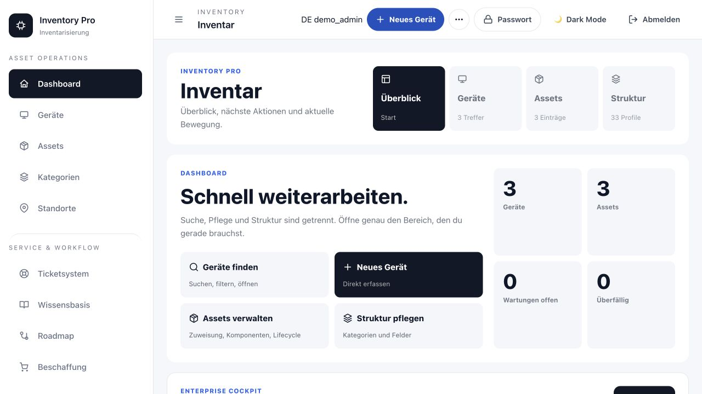

# Inventory Pro

Enterprise-Inventarisierung und Service-Management für Teams, die Geräte, Assets, Standorte, Beschaffung und Supportvorgänge in einem nachvollziehbaren System steuern wollen.



> Die Abbildung zeigt eine isolierte Demo-Instanz mit synthetischen Daten. Sie enthält keine Daten einer produktiven Installation.

## Was Inventory Pro verbindet

- **Inventar und Lifecycle:** Geräte, Asset-Einträge, Kategorien, Standorte, Zuweisungen, Komponenten, Garantie- und Beschaffungsdaten.
- **Service Desk:** Tickets mit SLA, Prioritäten, Anhängen, Watchern, Kommentaren, Aktivitäten und nachvollziehbaren Statuswechseln.
- **Wissensgestützte Bearbeitung:** Direkt im Ticket erscheinen passende Wissensartikel und vergleichbare, bereits gelöste Fälle – immer innerhalb der jeweiligen Berechtigung.
- **Kontrollierte Änderungen:** Zu jedem Change wird ein Review geführt. Ein Change kann erst gelöst oder geschlossen werden, wenn das zugehörige Review abgenommen wurde.
- **Operative Übersicht:** Das Workflow-Cockpit macht fehlende Beziehungen, Service-Risiken, Lifecycle-Lücken und nächste Arbeitszüge sichtbar.
- **Standortbezogene Arbeit:** Ein Standort führt direkt zu der auf ihn gefilterten Geräteansicht.
- **Sichere Instanzverknüpfung:** Verknüpfte Inventory-Pro-Instanzen bleiben getrennt. Die Zielinstanz liefert nur die Daten, für die der angemeldete Benutzer dort berechtigt ist.

## Sicherheitsmodell

- Rollen und fein abgestufte Berechtigungen für Daten und Aktionen
- Passwort-Hashing, optionale TOTP-Zwei-Faktor-Authentifizierung und sichere Passwort-Resets
- Auditierbare Ticket- und Änderungsverläufe
- Verschlüsselte, serverseitige Verknüpfungsgeheimnisse; keine Zugangsdaten im Browser speichern
- Zwei explizite Verbindungsarten für andere Instanzen:
  - **Internet:** ausschließlich HTTPS mit geprüfter Zertifikatskette; private und lokale Zielnetze werden abgewiesen.
  - **Lokales Netzwerk:** ausschließlich private LAN-Adressen; öffentliche, Loopback- und Metadaten-Ziele werden abgewiesen.
- Release- und Update-Metadaten enthalten keine Inventar- oder Kundendaten.

## Schnellstart für Entwicklung

Voraussetzung: Python 3.12 oder neuer.

```bash
python3 -m venv .venv
source .venv/bin/activate
pip install -r requirements.txt
python app.py
```

Danach ist die Anwendung standardmäßig unter `http://localhost:5000` verfügbar. Für reale Umgebungen müssen insbesondere `APP_SECRET_KEY`, der Datenpfad und die Uploads als geschützte Infrastruktur-Konfiguration gesetzt werden – keine Geheimnisse in Git ablegen.

## Betrieb mit Docker

```bash
docker compose up -d --build app
```

Die Standard-Compose-Datei nutzt ein Docker-Volume für `/data`. Bestehende Installationen mit einem Bind-Mount müssen diesen Mount in ihrer produktionsspezifischen Compose-Override-Datei ausdrücklich beibehalten, bevor sie auf Compose umgestellt werden. So bleibt die vorhandene Datenbank unangetastet.

Wichtige Konfigurationen:

| Variable | Zweck |
| --- | --- |
| `APP_SECRET_KEY` | Zufälliger, persistenter Flask-Session-Schlüssel |
| `INVENTORY_DATABASE_PATH` | Pfad zur SQLite-Datenbank innerhalb der Instanz |
| `INVENTORY_UPLOADS_DIR` | Persistenter Speicher für Uploads |
| `INVENTORY_LINKS_ENCRYPTION_KEY` | Schlüssel zum Schutz von Instanzverknüpfungen |
| `INVENTORY_UPDATER_ENABLED` | Schaltet die Update-Einstellungen frei; Standard ist `0` |

## Signierte automatische Updates

Automatische Updates sind standardmäßig ausgeschaltet. Nach bewusstem Aktivieren in **Einstellungen → Server → Automatische Updates** prüft ein separater Updater nur den stabilen Release-Kanal. Er akzeptiert ausschließlich signierte Release-Manifeste und unveränderliche Container-Digests aus `ghcr.io/pondsec/inventorypro`.

Vor einem Update erstellt der Updater ein lokales SQLite-Backup und prüft dessen Integrität. Nach dem Rollout wartet er auf den Health-Check. Schlägt ein Schritt fehl, bleibt die laufende Version erhalten oder wird auf das vorherige Image zurückgesetzt. Die Instanzdaten verlassen dabei zu keinem Zeitpunkt den Server.

Der Updater wird bewusst separat und nur mit dem Compose-Profil `updater` gestartet:

```bash
docker compose --profile updater up -d
```

Der Sidecar benötigt Zugriff auf den lokalen Docker-Socket, damit er einen geprüften Rollout und gegebenenfalls ein Rollback ausführen kann. Dieser privilegierte Zugriff gehört ausschließlich auf einen abgesicherten Server und ist regelmäßig zu überprüfen.

## Qualitätssicherung

```bash
python3 -m unittest discover -s tests -p 'test_*.py'
```

Die Tests decken unter anderem Rollen- und Sicherheitsgrenzen, Ticket- und Review-Workflows, Wissenskontext, Standortfilter, mobile Bedienung, sichere Instanzverknüpfungen und den Update-Mechanismus ab.

## Releases

Jeder Push nach `main` startet die Release-Pipeline. Sie baut ein unveränderliches GHCR-Image, erstellt ein Ed25519-signiertes Update-Manifest und veröffentlicht ein GitHub Release inklusive Deployment-Archiv. Der private Signaturschlüssel liegt ausschließlich als GitHub-Secret `INVENTORY_UPDATE_SIGNING_KEY` vor.

## Lizenz und Kontakt

Inventory Pro steht unter der [GNU Affero General Public License v3.0](https://www.gnu.org/licenses/agpl-3.0.de.html). Für eine kommerzielle Nutzung ohne Offenlegungspflicht kann eine separate Lizenz vereinbart werden.

PondSec · [joshua@pondsec.com](mailto:joshua@pondsec.com)
Stand: Juli 2026
