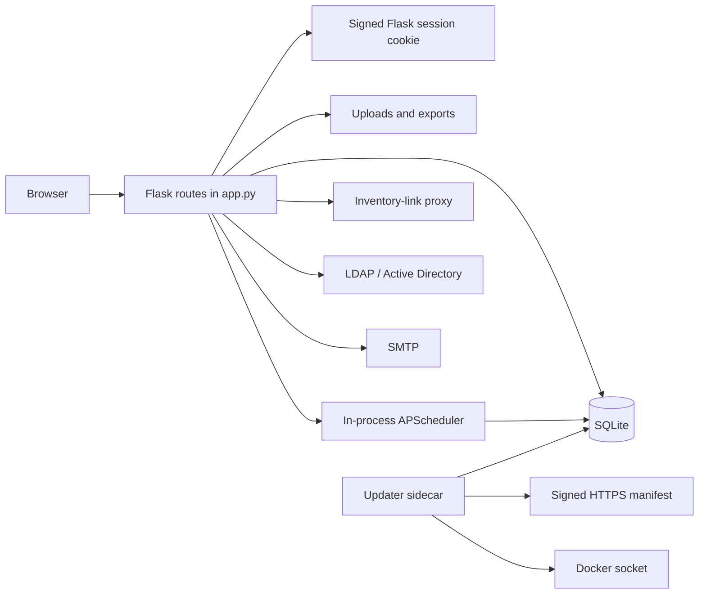

# Current architecture

## Scope and baseline

This document describes the application as found before the stabilization work
began. It is evidence-based: statements refer to the runtime code in `app.py`,
`docker_wsgi.py`, and `updater.py`, rather than intended future behaviour.

## Components

| Component | Current responsibility | Coupling / concern |
| --- | --- | --- |
| `app.py` | Flask setup, configuration, schema creation, HTTP routes, domain rules, scheduler jobs, backup/import, links, terminal and authentication | 16k-line central module; almost every concern imports or mutates its globals |
| SQLite | Primary persistence through `sqlite3` and request-local `g._database` | Schema changes are inline `CREATE`/`ALTER` statements, not versioned migrations |
| Flask templates and `static/` | Server-rendered UI plus browser JavaScript APIs | API and UI contracts are implicit in handlers and JavaScript |
| APScheduler | Backup and health-check execution inside the web process | Each worker can schedule work unless deployment keeps one worker |
| Filesystem | uploads, runtime settings, initial credentials, backups, update policy | Paths are environment-configured; ownership and retention are process-local |
| Optional updater sidecar | signed release manifest fetch, image switch, database snapshot and rollback | Docker socket grants host-equivalent control to the updater container |
| External systems | LDAP, SMTP, inventory-link endpoints, health endpoints | Outbound network policy is distributed across helper functions |

## Principal data flows

Requests use the global Flask application. `get_db()` creates one SQLite
connection per request context and enables foreign keys, WAL and a busy timeout.
Most handlers execute SQL directly. Uploads and imports write to the configured
filesystem before or while creating database records.

## Authentication and authorization

Local accounts use Werkzeug password hashes. LDAP/AD authentication optionally
creates a local placeholder account after a successful bind. MFA uses TOTP and
hashed recovery codes. Login state, username and MFA state are stored in the
Flask signed cookie session. Login throttling uses an in-memory cache and login
attempts are persisted in SQLite.

Authorization is role/permission based. Roles, permissions, role mappings and
user-role mappings reside in SQLite. `login_required`, `require_permission`,
and `require_permissions` protect many routes. Access checks must be reviewed
route by route because the app has no central policy layer.

## Important operational flows

### Backup and restore

Manual and scheduled backups use SQLite's backup API or `pg_dump` when a
`DATABASE_URL` is configured. The code can encrypt backups with
`BACKUP_ENCRYPTION_KEY`. The signed updater takes a SQLite snapshot before an
image change and restores it when its health check fails. There is no single,
documented restore protocol for all user-managed backups yet.

### Inventory links and proxy

Users own inventory-link records. The application stores an encrypted or
historically plaintext secret, validates the target, makes outbound HTTP
requests with environment proxies disabled and rewrites proxied HTML/CSS/JS
responses. Login-mode cookies and proxy rate-limit state live in process memory.

### Updates

The updater fetches a bounded HTTPS manifest, validates semantic version,
repository and image digest, verifies Ed25519 signatures, backs up the database,
uses Docker Compose to change the image and polls a health URL. It records state
and rolls back the previous image on a failed health check.

## Global state and caches

`RUNTIME_SETTINGS_CACHE`, scheduler instances, rate-limit dictionaries,
inventory-link login sessions, terminal rate limits and the health registry are
module globals. They are not shared across workers, do not have uniformly
bounded cleanup, and are reset on process restart. This makes multi-worker
operation and horizontal scaling unsafe for those features.

## Security-critical areas

* Application secret key and session cookie configuration.
* Authentication, MFA, password reset/change and authorization decorators.
* Inventory-link secret encryption, proxy target validation and response rewrite.
* LDAP bind credentials, SMTP settings and terminal execution/database routes.
* Upload/import archive parsing and filesystem paths.
* Backup encryption and restore integrity.
* Updater manifest verification, image digest enforcement and Docker socket.

## Main technical debt and high-risk migrations

* `app.py` is a coupled monolith; extracting code can change route registration,
  global state and import-time configuration.
* Inline schema evolution has no durable migration history or downgrade story.
* SQLite remains suitable for a single writer-oriented installation, not a
  multi-worker or multi-node deployment.
* The existing default secret-key and inventory-link plaintext compatibility
  behaviour are unsafe for production.
* Same-origin checks are not a complete CSRF design, especially for forms and
  authenticated fetch requests without an Origin header.
* Proxy trust derives from request headers without a trusted-proxy boundary.
* Scheduler, rate limit and link-login cache extraction requires preserving
  timing semantics and single-execution guarantees.

## Test gaps observed at baseline

The suite covers many domain workflows, inventory links, security boundaries and
the updater. It did not provide a production secret-key matrix, CSRF token
negative tests, encryption-key rotation/migration tests, database migration
upgrade/downgrade tests, or end-to-end restore tests. Mobile UI tests also
require an explicitly installed Playwright browser.
