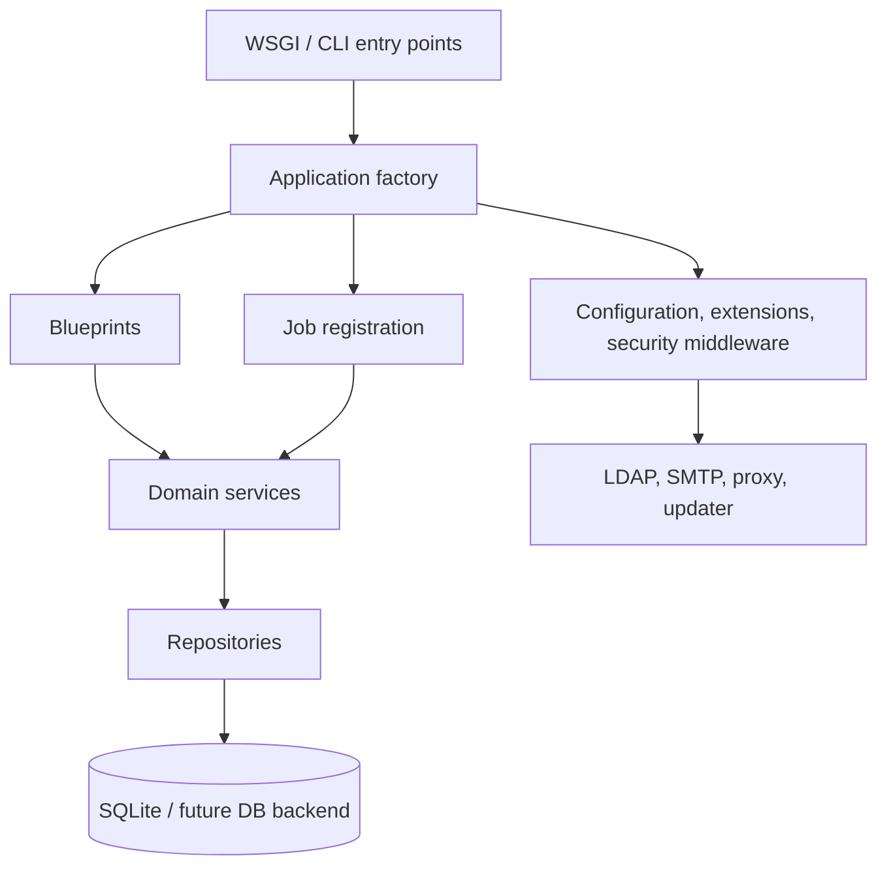

# Target architecture

## Design principles

Inventory Pro remains a Flask application with SQLite support. The target is a
modular monolith: deployment stays simple while boundaries make changes,
security reviews and tests tractable. Public routes and current data stay
compatible unless a documented migration explicitly changes them.

## Proposed package boundaries

* `inventorypro.config`: typed environment and runtime configuration; rejects
  unsafe production defaults before the application accepts traffic.
* `inventorypro.security`: secret-key policy, CSRF, proxy policy, headers,
  encryption and security-event logging.
* `inventorypro.db`: connection lifecycle, versioned migration runner and
  transaction helpers.
* `inventorypro.auth`, `assets`, `tickets`, `settings`, `inventory_links`,
  `backup`, `health`, and `terminal`: blueprints/services/repositories by
  domain. A compatibility route layer preserves current URLs while a domain is
  moved.
* `inventorypro.jobs`: explicit job registration and a single scheduler owner.
* `inventorypro.integrations`: allowlisted network clients and external protocol
  adapters.

## Constraints and compatibility

* Flask, SQLite and existing HTTP endpoints remain supported.
* The application factory is introduced behind a compatibility WSGI entry point
  so current imports and deployments continue to work during extraction.
* Schema changes are forward-only migrations with preflight backups and an
  explicit downgrade/restore procedure. SQLite migrations are transactional
  where SQLite supports it.
* One scheduler process is the default; multi-worker deployments disable
  embedded scheduling unless a future external scheduler is configured.
* No new product modules, AI features, microservices or framework rewrite are
  part of this architecture.

## Security target

Production startup fails without a persistent application secret. Secrets are
encrypted using a validated keyring; plaintext compatibility is a deliberate,
temporary migration action rather than a runtime default. Every browser write
requires CSRF validation; all proxy headers are trusted only from configured
proxy networks; and outbound inventory-link requests are deny-by-default for
loopback, link-local, private and metadata address ranges unless an explicit
administrator-approved scope is configured.

## Extraction sequence

1. Establish configuration, security, migration and test seams without moving
   endpoints.
2. Extract authentication and settings, which own startup-sensitive behaviour.
3. Extract assets, tickets, inventory links, backups and health domains behind
   compatible routes.
4. Remove compatibility wrappers only after usage and regression coverage prove
   them unnecessary.

Each extraction is a separate pull request with unchanged route contract tests,
database preflight and a documented rollback to the previous release.
